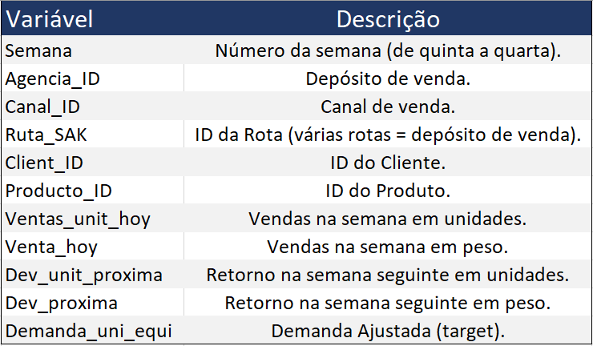
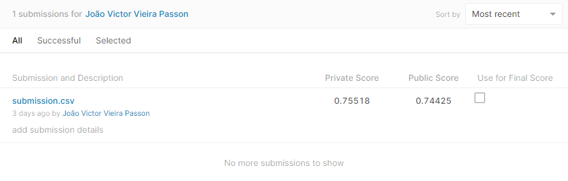

```{r setup, include=FALSE, warning=FALSE}
knitr::opts_chunk$set(echo = TRUE)
```

### **Visão Geral**

O objetivo principal desse projeto é solucionar um problema negócio real que quase
todas as empresas enfrentam: prever a expectativa de Demanda para determinado produto.
Com essa informação nas mãos a empresa poderá atender seus clientes de maneira adequada,
garantindo o fornecimento e reduzindo custos.

O Grupo Bimbo é uma empresa mexicana de fabricação de produtos de panificação entre as
mais importantes empresas do setor. O Grupo possui uma das maiores redes de distribuição 
do mundo, ultrapassando 52.000 rotas. Tudo isso graças ao posicionamento da
marca, grande volume de produção e gigantesco número de vendas.

Os cálculos diários de estoque eram realizados por funcionários de vendas de entregas 
diretas, que deviam, sozinhos, prever a necessidade de estoque dos produtos e a demanda
com base em suas experiências pessoais em cada loja.

Buscanco automatizar isso, ao final desse projeto, o algoritmo de Machine Learning deve 
prever com precisão a demanda de estoque com base nos dados históricos de vendas. Isso 
fará com que os consumidores de suas lojas parceiras não fiquem olhando para prateleiras 
vazias, além de reduzir o valor gasto com retorno de produtos que não foram vendidos ou 
expiraram.

Para a construção desse projeto utilizaremos a Linguagem R.

Link para mais informações: <https://www.kaggle.com/c/grupo-bimbo-inventory-demand>


#### **Conjunto de Dados**

O Dataset disponibilizado pela empresa consiste em 7 semanas de vendas no México. Toda 
semana, existem caminhões de entregas que entregam produtos às lojas. E cada transação 
dessa consiste em vendas e retornos. Os retornos são produtos que não foram vendidos ou 
expiraram. A demanda por um produto em certa semana é definida como a venda dessa semana 
subtraída pelo retorno da próxima semana.

Foram apresentados dois datasets: treino e teste. Cada um dividido com base no tempo.

É importante ressaltar que há produtos no dataset de teste que não existem no dataset de
treino. Isso é um comportamento esperado em dados de estoque, pois existem novos produtos
sendo vendidos a todo momento. Portanto, nosso modelo deve ser capaz de lidar com valores
faltantes.

O conjunto de dados é relativamente grande possuindo mais de 74.000.000 observações, com
13 variáveis. Um dos maiores desafios disso tudo é a limitação da memória (possuo 8GB de
RAM) e o tempo de treino do modelo. Portanto, estamos diante de um trade-off, precisamos
adicionar mais variáveis e usar mais dados para performar o modelo, mas isso consome mais
memória e tempo.

As descrições das variáveis encontradas nos datasets se encontram na tabela abaixo:

```{r echo=FALSE, fig.align='center', out.width='50%'}

```


### **Carregando os Dados:**

Primeiro iremos carregar todos os pacotes utilizados durante o projeto e iremos aumentar o limite de memoria utilizada pelo R para não termos problemas.
```{r Pacotes, message=FALSE, warning=FALSE, include=FALSE}
library(tidyverse)
library(data.table)
library(ggplot2)
library(hrbrthemes)
library(fastDummies)
library(xgboost)
library(readr)

memory.limit(9999999999999)
```

Agora, usando o pacote *data.table* carregamos os datasets de treino e teste. Esse pacote
permite carregar com maior eficiência grandes conjuntos de dados, como o que trabalhamos
aqui.

```{r Dados Treino, message=FALSE, warning=FALSE}
train <- fread("train.csv")
```
```{r Dados Teste, message=FALSE, warning=FALSE}
test <- fread("test.csv")
```

### **Exploração dos Dados:**

Os dados isolados não nos dizem muita coisa, é preciso extrair informações dos dados. 
É exatamente isso que faremos na análise exploratória dos dados, buscamos entender as 
variáveis, compreender suas distribuições e relações.

Primeiro iremos compreender o volume de cada variável e posteriormente geraremos gráficos
para um melhor entendimento.

```{r}
head(train, 2)
```

```{r}
unique(train$Semana)
```

```{r}
length(unique(train$Agencia_ID))
```

```{r}
unique(train$Canal_ID)
```

```{r}
length(unique(train$Ruta_SAK))
```

```{r}
length(unique(train$Cliente_ID))
```

```{r}
length(unique(train$Producto_ID))
```

Como visto acima, o dataset de treino possui 7 semanas de documentação. Possuindo 552 
registros únicos na variável Agencia_ID, ou seja, 552 depósitos de vendas diferentes. 9 
possíveis canais de vendas. 3.603 rotas de entrega disponíveis. Uma enorme quantidades de
clientes. E, por fim, verifica-se mais de 1000 produtos ofertados.

É importante ressaltar que, em relação aos clientes, verificamos 880.604 IDs diferentes.
Isso não significa possuir 880.604 clientes únicos, pois, como documentado pela 
própria empresa, há clientes com IDs duplicados.

#### **Gráficos:**
```{r Gráfico Semanal, message=FALSE, warning=FALSE, fig.align='center'}
train %>% 
  group_by(Semana) %>% 
  summarise(total = sum(Demanda_uni_equil)) %>% 
  arrange(-total) %>% 
  ggplot(aes(x = factor(Semana), y = total, fill = factor(Semana))) +
  geom_bar(stat = "identity",
           show.legend = FALSE) +
  labs(title = "Vendas Semanais",
       x = "Semana",
       y = "Vendas") +
  theme_tinyhand(base_size = 12)
```

As semanas não possuem diferenças relevantes de vendas.

```{r BoxPlot Agencia, message=FALSE, warning=FALSE, fig.align='center'}
train %>% 
  group_by(Agencia_ID) %>% 
  summarise(soma = sum(Demanda_uni_equil)) %>% 
  arrange(-soma) %>% 
  ggplot(aes(x = soma)) +
  geom_boxplot(outlier.colour = "blue") +
  labs(title = "BoxPlot de Vendas Agências", 
       x = "Vendas") +
  theme_tinyhand(base_size = 12)
```

Há Agências com vendas discrepantes.

```{r Gáfico Canal, message=FALSE, warning=FALSE, fig.align='center'}
train %>% 
  group_by(Canal_ID) %>% 
  summarise(soma = sum(Demanda_uni_equil)) %>% 
  arrange(-soma) %>% 
  ggplot(aes(x = factor(Canal_ID), y = soma, fill = factor(Canal_ID))) +
  geom_bar(stat = "identity",
           show.legend = FALSE) +
  labs(title = "Vendas por Canal ID",
       x = "Canal",
       y = "Vendas") +
  theme_tinyhand(base_size = 12)
```

Os Canais possuem diferença no volume de vendas, portanto, o canal afeta a Demanda.

```{r Boxplot Rota, message=FALSE, warning=FALSE, fig.align='center'}
boxplot((train %>% 
           group_by(Ruta_SAK) %>% 
           summarise(soma = sum(Demanda_uni_equil)))[,2], 
        horizontal = TRUE)
title("BoxPlot de Vendas por Rota")
```

A variável Rota_ID possui muitos valores discrepantes.

```{r Boxplot Cliente, message=FALSE, warning=FALSE, fig.align='center'}
train %>% 
  group_by(Cliente_ID) %>% 
  summarise(soma = sum(Demanda_uni_equil)) %>% 
  ggplot(aes(x = soma)) +
  geom_boxplot(outlier.colour = "blue") +
  labs(title = "BoxPlot de Vendas Por Cliente",
       x = "Vendas") +
  theme_tinyhand(base_size = 12)
```

Podemos ver a existência de um cliente que compra muito, ficando muito distante do 
padrão. Posteriormente trataremos esse cliente.

```{r Boxplot Produtos, message=FALSE, warning=FALSE, , fig.align='center'}
train %>% 
  group_by(Producto_ID) %>% 
  summarise(soma = sum(Demanda_uni_equil)) %>% 
  ggplot(aes(x = soma)) +
  geom_boxplot(outlier.color = "blue") +
  labs(title = "BoxPlot Vendas por Produto",
       x = "Vendas") +
  theme_tinyhand(base_size = 12)
```

Há produtos que vendem muito comparado a outros. Talvez aqui podemos encontrar o
princípio de Pareto, onde 80% dos resultados (vendas) vem de 20% dos produtos. Não farei 
essa análise, mas seria interessante posteriormente.

```{r, , fig.align='center'}
boxplot(train$Demanda_uni_equil, 
        horizontal = TRUE)
title("BoxPlot de Demanda")
```

Há muita demanda concentrada perto de 0. Vamos tratar isso para treinar o modelo.

### **Tratando os Dados:**

Nessa etapa iremos extrair os outliers de algumas variáveis e retirar colunas que não 
serão utilizadas para o treinamento do modelo.

```{r}
# Função para extrair os Outliers com maiores demandas
outlier_categorical <- function(data, col){
  require(dplyr)
  
  filting <- data %>% 
    group_by_at(col) %>% 
    summarise(soma = sum(Demanda_uni_equil)) %>% 
    arrange(-soma)
  
  val.outliers <- boxplot.stats(filting$soma)$out
  outliers <- unlist((filting %>% 
                        filter(soma %in% val.outliers))[,1])
  names(outliers) <- NULL
  
  return(
    data %>% 
    mutate_at(c(val=col), as.integer) %>% 
    filter(!val %in% outliers) %>% 
    select(-val)
  )
}
```

Agora, iremos utilizar a função criada anteriormente para retirar os maiores compradores.
Esses foram vistos no BoxPlot de Client_ID por Demanda.

```{r message=FALSE, warning=FALSE}
train <- outlier_categorical(data = train, col = "Cliente_ID")
```

Também iremos retirar os outliers da variável *target*, Demanda_uni_equil.

```{r message=FALSE, warning=FALSE}
val.outliers <- boxplot.stats(train$Demanda_uni_equil, coef = 4.5)$out

train <- train %>% 
  filter(!Demanda_uni_equil %in% val.outliers)

# Retirando da memória para liberar espaço
rm(val.outliers)
rm(outlier_categorical)
```

```{r}
## Retirando dados que não serão utilizados
train$Venta_uni_hoy <- NULL
train$Venta_hoy <- NULL
train$Dev_uni_proxima <- NULL
train$Dev_proxima <- NULL
```

### **Feature Engineering:**

Nessa etapa iremos transformar a variável Canal_ID e construir algumas variáveis novas a 
partir das variáveis originais. Isso ajuda na construção de variáveis mais eficientes 
para o treinamento do modelo.

Primeiro iremos aplicar Dummy Coding para transformar o Canal_ID. Esse processo
transforma os 9 canais em 8 variáveis que só podem conter os valores 1 ou 0.

```{r}
## Transformando Variável Canal_ID - Aplicando Dummy Coding
train <- dummy_cols(.data = train, select_columns = "Canal_ID", remove_first_dummy =
                      TRUE)
train$Canal_ID <- NULL
glimpse(train)
```

Agora criaremos novas variáveis a partir da média da demanda e da probabilidade das
determinadas Agências e Produtos. Além disso, iremos excluir as variáveis Semana,
Ruta_SAK e Cliente_ID que escolhi não usar para a construção do modelo.

```{r}
train$Semana <- NULL
train$Ruta_SAK <- NULL
train$Cliente_ID <- NULL

train <- train %>% 
  group_by(Producto_ID) %>% 
  mutate(mean_prod = sum(Demanda_uni_equil)/n(),
         prop_prod = n()/nrow(train))

head(train[, c(12,13)])
```

```{r}
train <- train %>% 
  group_by(Agencia_ID) %>% 
  mutate(mean_agen = sum(Demanda_uni_equil)/ n(),
         prop_agen = n()/nrow(train))

head(train[, c(14,15)])

```

Por fim, normalizaremos as variáveis contínuas. E então iremos separar as agências e os 
produtos para juntar com os dados de teste.

```{r message=FALSE, warning=FALSE}
## Normalizando variável target, possui muito valores 0
hist(train$Demanda_uni_equil, breaks = 10)
```

```{r message=FALSE, warning=FALSE}
train$Demanda_uni_equil <- log1p(train$Demanda_uni_equil)
hist(train$Demanda_uni_equil, breaks = 10)
```

```{r}
## Normalizando outra variáveis
train$mean_prod <- scale(train$mean_prod)[,1]
train$mean_agen <- scale(train$mean_agen)[,1]
train$prop_prod <- scale(train$prop_prod)[,1]
train$prop_agen <- scale(train$prop_agen)[,1]
```

```{r}
## Separando Dataset dos Produtos, por Produto único
producto <- train[, c(2, 13, 12)] %>% 
  distinct()

train$Producto_ID <- NULL

## Separando Dataset das Agencias, por Agência única
agencia <- train %>% 
  select(Agencia_ID, mean_agen, prop_agen) %>% 
  distinct()

train$Agencia_ID <- NULL
```

### **Dividindo Dataset de Treino:**

Iremos dividir o conjunto de dados de treino e teste em dois para que possamos avaliar o
modelo.

```{r}
glimpse(train)
setDT(train)
```

```{r message=FALSE, warning=FALSE}

index <- sample(1:nrow(train), size = 0.7 * nrow(train), replace = FALSE)

logical <- vector()
length(logical) <- nrow(train)

for (i in index) {
  logical[i] <- 1
}

logical <- ifelse(is.na(logical) == TRUE, 0, 1)
train$index <- logical

# Removendo da Memória o que não será mais usado
rm(logical)
rm(index)
rm(i)

# Dividindo pelo Dplyr, pois é mais rápido que train[index,]
teste <- train %>% 
  filter(index == 0) %>% 
  select(-index)

train <- train %>% 
  filter(index == 1) %>% 
  select(-index)

```
```{r eval=FALSE, echo=TRUE}
# Salvando dataset de teste para facilitar utilizações posterior
# e liberar espaço na memória
write_csv(teste, "teste2.csv")
rm(teste)
```

### **Dataset de Teste:**

Vamos preparar o dataset de teste oficial. Aplicaremos Dummy Coding, removeremos algumas
variáveis e faremos um join com os dados de média e probabilidade por Produto e Agência. 
Então, salvaremos os dados de teste obtido para liberar espaço em memória.

```{r}
glimpse(test)
```

```{r message=FALSE, warning=FALSE}
# Removendo algumas variáveis
test$Semana <- NULL
test$Ruta_SAK <- NULL
test$Cliente_ID <- NULL

# Fazendo Dummy Coding
test <- dummy_cols(.data = test, select_columns = "Canal_ID", remove_first_dummy = TRUE)

# Left Join
test <- test %>% 
  left_join(producto, by = "Producto_ID")

test <- test %>% 
  left_join(agencia, by = "Agencia_ID")

# Removendo mais algumas variáveis
test$Agencia_ID <- NULL
test$Canal_ID <- NULL
test$Producto_ID <- NULL

glimpse(test)
```

```{r}
sum(is.na(test))
```

```{r eval=FALSE, message=FALSE, warning=FALSE, echo=TRUE}
# Liberando espaço na memória
write.csv(test, "test2.csv")
```

```{r}
rm(agencia)
rm(producto)
rm(test)
```


### **Treinando o Modelo:**

Escolhemos o algoritmo XGBoost por ser um algoritmo muito mais flexível e ser
computacionalmente mais rápido quando aplicado em conjunto de treino com grande 
uantidade de dados. Além disso, o XGBoost lida muito bem com valores faltantes, como os 
que temos no dataset anterior.

```{r eval=FALSE, echo=TRUE}
# Criando DMatrix
labels <- train$Demanda_uni_equil
train <- train[, -1]

dtrain <- xgb.DMatrix(data = as.matrix(train),
                      label = labels, missing = NA)

rm(labels)
rm(train)

#write_rds(dtrain, "dtrain.rds")
```

```{r eval=FALSE, echo=TRUE}
# Treinando o Modelo
model <- xgb.train(
  params = list(
    objective = "reg:squarederror",
    booster = "gbtree",
    eta = 0.2,
    max_depth = 5,
    subsample = 0.7,
    colsample_bytree = 0.7
  ), data = dtrain,
  nrounds = 100,
  verbose = T,
  print_every_n = 5,
  maximize = FALSE,
  nthread = 16
)

#write_rds(model, "model.rds")
```

```{r include=FALSE, echo=FALSE}
model <- read_rds("model.rds")
```

### **Avaliando o Modelo:**

Avaliando o modelo nos dados de teste que derivamos do dataset de treino.

```{r message=FALSE, warning=FALSE}
# Carregando os dados que salvamos anteriormente
test1 <- read_csv("teste2.csv")

head(test1)
```

```{r}
# Separando a variável target das outras
Y <- test1$Demanda_uni_equil
test1 <- test1 %>% select(-Demanda_uni_equil)

# Fazendo as previsões e voltando o padrão dos resultados
previsoes <- predict(model, as.matrix(test1))
previsoes <- expm1(previsoes)
```

```{r message=FALSE, warning=FALSE}
# Tratando as previsões negativas, se existirem
# Pois não existe demanda menor do que 0

for (i in 1:length(previsoes)) {
  if (previsoes[i] < 0) {
    previsoes[i] = 0
  }
}
```

```{r}
# Calculando o R-Squared
actual <- expm1(Y)

rss <- sum((previsoes - actual) ^ 2)
tss <- sum((actual - mean(actual)) ^ 2)
rsq <- 1 - (rss/tss)
rsq
```

### **Prevendo no Dataset de Teste Oficial:**

```{r message=FALSE, warning=FALSE}
# Carregando o dataset de teste oficial salvo
test <- read_csv("test2.csv", col_types = cols("i","i", "i", "i", "i", "i", "i", "i", "i", "i",
                                                "d", "d","d", "d"))

# Reposicionando as colunas e retirando a variável X1 que o write_csv criou
test <- test %>% 
  relocate(X1,id,Canal_ID_2,Canal_ID_4,Canal_ID_5,Canal_ID_6,Canal_ID_7,Canal_ID_8,
           Canal_ID_9, Canal_ID_11, mean_prod, prop_prod, mean_agen, prop_agen) %>% 
  select(-X1)

# Prevendo
previsoes.of <- predict(model, as.matrix(test %>% select(-id)))
previsoes.of <- expm1(previsoes.of)

# Verificando se existe previsões negativas
sum(previsoes.of < 0)
```

```{r eval=FALSE, echo=TRUE}
# Como não existe demanda quebrada
previsoes.of <- round(previsoes.of)

## Criando Data Frame para submissão e salvando
df.submission <- data.frame(id = test$id,
                            Demanda_uni_equil = previsoes.of)

head(df.submission)
tail(df.submission)

write_csv(df.submission, "submission.csv")
```

Após submissão do dataset no Kaggle obtemos Score:
**Privado**: 0.75518
**Público**: 0.74425

```{r echo=FALSE, fig.align='center', out.width='75%'}

```

### **Contato:**
Qualquer dúvida, sugestão ou outros motivos fico a inteira disposição para conversar!

E-mail: victor.passon@yahoo.com.br

Linkedin: <https://www.linkedin.com/in/victorpasson/>

Github: <https://github.com/victorpasson>

Site Portfolio: <http://victorpasson.github.io/>

